# 1) Security & routing for `OPENAI_API_KEY` (no secrets in the browser)

**Principle:** the key stays only in the **Thin Host** (server), never in a plugin’s client bundle.
**Mechanism:** the Host exposes a **proxy/adapter endpoint** (server-to-server) that injects the key at runtime.

## Host: `/api/ai/chat` (Node/Express-style, but adapt to your stack)

```ts
// host-thin/src/routes/aiChat.ts
import type { Request, Response } from "express";
import fetch from "node-fetch";

const OPENAI_URL = process.env.OPENAI_BASE_URL ?? "https://api.openai.com/v1/chat/completions";
const MODEL = process.env.OPENAI_MODEL ?? "gpt-4.1-mini";

export async function aiChat(req: Request, res: Response) {
  // authN/Z for plugins: require a signed plugin token or check pluginId
  const pluginId = req.headers["x-plugin-id"];
  if (!pluginId) return res.status(401).json({ error: "missing plugin id" });

  const apiKey = process.env.OPENAI_API_KEY;
  if (!apiKey) return res.status(500).json({ error: "host misconfigured: no OPENAI_API_KEY" });

  const { messages, tools, tool_choice, temperature } = req.body;
  const r = await fetch(OPENAI_URL, {
    method: "POST",
    headers: {
      "Authorization": `Bearer ${apiKey}`,
      "Content-Type": "application/json"
    },
    body: JSON.stringify({
      model: MODEL,
      temperature: temperature ?? 0.2,
      messages, tools, tool_choice
    })
  });
  const data = await r.json();
  res.status(r.ok ? 200 : 502).json(data);
}
```

**Plugin side (library, server or client):** call the **Host** endpoint, **not OpenAI directly**.

```ts
// library plugin runtime call (browser-safe)
export async function chatViaHost(messages: any[], opts: { tools?: any; tool_choice?: any; temperature?: number } = {}) {
  const r = await fetch("/api/ai/chat", {
    method: "POST",
    headers: { "Content-Type": "application/json", "x-plugin-id": "library-plugin" },
    body: JSON.stringify({ messages, ...opts })
  });
  if (!r.ok) throw new Error(`Host AI error: ${r.status}`);
  return r.json();
}
```

**Environments:** use GitHub **Environments** (`dev`, `staging`, `prod`) to store the prod `OPENAI_API_KEY` and a safer dev key; deploy host with env-scoped secrets.

---

# 2) Coordination primitives (GitHub-native)

* **Issues** = shared conversation + task list. Agents update with checklists & links.
* **Labels** signal intent: `needs-host-input`, `contract-proposal`, `contract-accepted`.
* **repository_dispatch** = machine-to-machine pings for “your turn”.
* **Reusable workflows** = identical gates everywhere (plan, implement, test, pack, verify).
* **Artifacts** = pass build outputs (e.g., `.tgz`) between plugin and host E2E.

---

# 3) The “Data Orchestration Contract” (the thing they converge on)

Create a small, typed doc the agents co-edit in the **Issue** and store under KB once agreed.

`/kb/contracts/library-plugin.openai.yml` (lives in orchestrator later)

```yaml
apiVersion: renderx/v1
kind: AiRoutingContract
plugin: library-plugin
host:
  endpoint: /api/ai/chat
  auth:
    pluginHeader: x-plugin-id
    allowedPluginIds: ["library-plugin"]
openai:
  model: gpt-4.1-mini
  baseUrl: https://api.openai.com/v1
  keyLocation: ENV:OPENAI_API_KEY
policy:
  pii: "disallowed"
  maxInputTokens: 6000
  temperature: 0.2
  retry: { attempts: 2, backoffMs: 500 }
version: 1
```

---

# 4) The Issue Template (starts the back-and-forth)

`/.github/ISSUE_TEMPLATE/plugin-openai-chat.yml` (in **plugin repo**)

```yaml
name: OpenAI Chat Integration (Plugin ↔ Host)
labels: ["needs-host-input", "contract-proposal"]
body:
  - type: markdown
    attributes:
      value: |
        This issue tracks designing the routing of OPENAI_API_KEY through the Host adapter.
  - type: input
    id: goal
    attributes: { label: Goal, description: "What the plugin needs the chatbot to do" }
  - type: textarea
    id: proposal
    attributes:
      label: Plugin proposal
      value: |
        - Endpoint: /api/ai/chat
        - Payload: { messages[], tools?, tool_choice?, temperature? }
        - Security: x-plugin-id header = "library-plugin"
        - Contract: /kb/contracts/library-plugin.openai.yml
  - type: checkboxes
    id: tasks
    attributes:
      label: Task list
      options:
        - label: Host evaluates security, creates architecture note
        - label: Contract agreed, saved to orchestrator KB
        - label: Plugin branch created and implementation started
        - label: Host branch created (endpoint + tests)
        - label: E2E added in thin host harness
        - label: Plugin PR → green → publish npm
        - label: Host PR → green → merge → install new npm
```

---

# 5) Agent workflows (the conversation + state moves)

## Plugin agent: **ask host & wait**

`.github/workflows/agent-plugin-openai.yml` (plugin repo)

```yaml
name: agent-plugin-openai
on:
  workflow_dispatch:
    inputs:
      issue: { required: true, type: string }   # e.g. 42
jobs:
  ask-host:
    runs-on: ubuntu-latest
    steps:
      - uses: actions/checkout@v4
      - name: Comment and ping host agent
        run: |
          gh issue comment ${{ inputs.issue }} --body "🔔 @host-agent: please review OpenAI routing. Proposing /api/ai/chat with x-plugin-id=library-plugin."
          gh api repos/bpmcloud/host-thin/dispatches \
            -f event_type=RenderX.HostResearch \
            -f client_payload='{"plugin":"library-plugin","issue":${{ inputs.issue }}}'
        env: { GH_TOKEN: ${{ secrets.GH_PAT_REPO_DISPATCH }} }
```

## Host agent: **research, propose, answer**

`host-thin/.github/workflows/agent-host-research.yml`

````yaml
name: agent-host-research
on:
  repository_dispatch:
    types: [RenderX.HostResearch]
jobs:
  research-and-reply:
    runs-on: ubuntu-latest
    steps:
      - uses: actions/checkout@v4
      - name: Draft issue in host repo (architecture note)
        run: |
          gh issue create --title "AI adapter for library-plugin" \
            --body "Evaluating /api/ai/chat proxy with x-plugin-id. Env: OPENAI_API_KEY via environment."
      - name: Respond on plugin issue with proposed contract
        run: |
          gh api repos/bpmcloud/plugins-library-plugin/issues/${{ github.event.client_payload.issue }}/comments \
            -f body='Proposed contract:
            ```yaml
            host: { endpoint: /api/ai/chat, auth: { header: x-plugin-id, allowed: [library-plugin] } }
            openai: { model: gpt-4.1-mini, keyLocation: ENV:OPENAI_API_KEY }
            ```'
        env: { GH_TOKEN: ${{ secrets.GH_PAT_REPO_DISPATCH }} }
````

## Plugin agent: **accept & start implementation**

`plugins-library-plugin/.github/workflows/agent-plugin-implement.yml`

```yaml
name: agent-plugin-implement
on:
  issue_comment:
    types: [created]
jobs:
  start:
    if: contains(github.event.comment.body, 'Proposed contract')
    runs-on: ubuntu-latest
    steps:
      - uses: actions/checkout@v4
      - name: Update issue checklist + create branch
        run: |
          gh issue edit ${{ github.event.issue.number }} --add-label "contract-accepted"
          git switch -c feat/openai-chat
      - name: Implement client call + unit tests
        run: |
          node scripts/pb-scaffold.ts openai-chat --desc "chat via host adapter"
          npm -w packages/library-plugin test
      - name: Open PR
        run: gh pr create -t "feat: OpenAI chat via host adapter" -b "Implements contract; adds client."
```

## Host agent: **implement adapter**

`host-thin/.github/workflows/agent-host-implement.yml`

```yaml
name: agent-host-implement
on:
  repository_dispatch:
    types: [RenderX.ContractAccepted]
jobs:
  implement:
    runs-on: ubuntu-latest
    steps:
      - uses: actions/checkout@v4
      - name: Create branch & add adapter route + tests
        run: |
          git switch -c feat/ai-adapter-library-plugin
          # (apply route code + tests)
      - name: PR
        run: gh pr create -t "feat: AI adapter for library-plugin" -b "Adds /api/ai/chat, secures with x-plugin-id."
```

> The plugin agent can emit `RenderX.ContractAccepted` once it toggles the Issue to “accepted”, so the host starts its branch.

---

# 6) Publish → notify → host install → E2E

## Plugin: publish on merge/tag

`plugins-library-plugin/.github/workflows/release.yml`

```yaml
name: release
on: push: { branches: [ main ] }
jobs:
  pack-publish:
    runs-on: ubuntu-latest
    steps:
      - uses: actions/checkout@v4
      - uses: actions/setup-node@v4
        with: { node-version: 20, registry-url: "https://registry.npmjs.org" }
      - run: npm ci && npm test && npm run build
      - run: npm publish --provenance --access public
        env: { NODE_AUTH_TOKEN: ${{ secrets.NPM_TOKEN }} }
      - name: Notify host of new version
        run: |
          PKG=$(node -p "require('./packages/library-plugin/package.json').name")
          VER=$(node -p "require('./packages/library-plugin/package.json').version")
          gh api repos/bpmcloud/host-thin/dispatches \
            -f event_type=RenderX.PluginPublished \
            -f client_payload="{\"package\":\"$PKG\",\"version\":\"$VER\"}"
        env: { GH_TOKEN: ${{ secrets.GH_PAT_REPO_DISPATCH }} }
```

## Host: install new version and run E2E

`host-thin/.github/workflows/agent-host-install-e2e.yml`

```yaml
name: agent-host-install-e2e
on:
  repository_dispatch:
    types: [RenderX.PluginPublished]
jobs:
  install-and-e2e:
    runs-on: ubuntu-latest
    steps:
      - uses: actions/checkout@v4
      - uses: actions/setup-node@v4
        with: { node-version: 20 }
      - run: npm ci
      - name: Install new plugin version
        run: npm i ${{ github.event.client_payload.package }}@${{ github.event.client_payload.version }}
      - name: Run host E2E
        run: npm run e2e
```

---

# 7) Dashboard & KB sync

* Both agents **POST gate results** back to the orchestrator dashboard (or upload a `pb-gates.json` artifact).
* Once the contract stabilizes, the orchestrator bot commits `/kb/contracts/library-plugin.openai.yml` to the orchestrator repo from the Issue content.

---

# 8) Mermaid sequence (your scenario, end-to-end)

```mermaid
sequenceDiagram
  autonumber
  participant Plugin as Library Plugin Agent (repo A)
  participant Host as Thin Host Agent (repo B)
  participant Queue as GitHub Actions Queue
  participant NPM as npm Registry
  participant Dash as Delivery Dashboard

  Plugin->>Queue: workflow_dispatch (Ask Host)
  Queue->>Host: repository_dispatch RenderX.HostResearch
  Host->>Host: Research & draft proposal (Issue in Host)
  Host->>Plugin: Comment with proposed AiRoutingContract
  Plugin->>Plugin: Accept contract, update Issue, create branch
  Plugin->>Queue: plan → implement → unit/E2E → pack → verify
  Queue-->>Dash: POST gates/artifacts
  Plugin->>Queue: Merge main, publish npm
  Queue->>NPM: npm publish (NPM_TOKEN)
  Plugin-->>Host: repository_dispatch RenderX.PluginPublished {pkg,ver}
  Host->>Queue: Install new version, run Host E2E
  Queue-->>Dash: POST gates (host E2E)
  Host->>Host: Merge main (adapter route)
  Dash->>Dash: Show green for both repos & contract linked in KB
```



---

# 9) “Do this now” checklist

* [ ] Add the **Issue template** to the plugin repo.
* [ ] Add the **adapter route** to the host (and tests).
* [ ] Add the **four workflows** (plugin ask → host research → plugin implement → host implement) with `repository_dispatch`.
* [ ] Add **release** + **host install/E2E** workflows.
* [ ] Add **dashboard ingest** endpoint (optional but nice).
* [ ] Store finalized contract in **orchestrator `/kb/contracts`**.

---

---

Totally agree—this is where “agent-to-agent” shines. Here’s a practical, GitHub-native playbook for **host E2E failure triage** that coordinates the **Thin Host** and the **Plugin** until green, with clear handoffs, artifacts, and automatic retests.

---

# Overview (tight loop)

1. **Host E2E fails →** auto-capture repro + logs.
2. **Open cross-repo incident issue** (Host → Plugin), attach artifacts, label & assign.
3. **Plugin agent** creates fix branch, writes failing unit/E2E (red → green), publishes **fix version** (patch).
4. **Host agent** auto-installs the new version, reruns E2E.
5. Loop until green; **close incident** + post summary back to orchestrator dashboard/KB.

---

# A) Host: capture & file incident (on E2E failure)

Add a failure handler to the Host’s E2E workflow:

```yaml
# host-thin/.github/workflows/host-e2e.yml
name: host-e2e
on:
  workflow_dispatch:
  repository_dispatch: { types: [RenderX.PluginPublished, HostE2E] }

jobs:
  e2e:
    runs-on: ubuntu-latest
    steps:
      - uses: actions/checkout@v4
      - uses: actions/setup-node@v4
        with: { node-version: 20 }
      - run: npm ci
      - name: (optional) install plugin version from dispatch
        if: ${{ github.event_name == 'repository_dispatch' && github.event.client_payload.package }}
        run: npm i ${{ github.event.client_payload.package }}@${{ github.event.client_payload.version }}
      - name: Run E2E
        id: run
        run: npm run e2e || echo "E2E_FAILED=1" >> $GITHUB_ENV

      - name: Collect repro & logs
        if: env.E2E_FAILED == '1'
        run: |
          node scripts/pb-e2e-repro.js --out .repro.tar.gz
          mkdir -p .fail
          cp -r ./playwright-report .fail/report || true
          cp -r ./logs .fail/logs || true
          tar -czf .fail/repro.tar.gz -C . repro.tar.gz
      - name: Upload failure artifact
        if: env.E2E_FAILED == '1'
        uses: actions/upload-artifact@v4
        with: { name: host-e2e-failure, path: .fail }

      - name: Open/Update incident in plugin repo
        if: env.E2E_FAILED == '1'
        run: |
          PLUGIN_REPO=${{ vars.PLUGIN_REPO }}          # e.g. bpmcloud/plugins-tiny-svg-editor
          PLUGIN_PKG=${{ vars.PLUGIN_PACKAGE }}        # e.g. @bpm/tiny-svg-editor
          TITLE="Incident: Host E2E failing with ${PLUGIN_PKG} @ $(node -p "require('./package.json').version")"
          BODY=$(cat << 'EOF'
          ### Symptom
          Host E2E failed. See artifacts attached to this run.

          ### Host env
          - Node: ${{ runner.os }} / 20.x
          - Host commit: ${{ github.sha }}

          ### Suspected plugin/package
          - Repo: ${{ vars.PLUGIN_REPO }}
          - Package: ${{ vars.PLUGIN_PACKAGE }}
          - Version: ${{ github.event.client_payload.version || 'current lockfile' }}

          ### Artifacts
          - Run: ${{ github.server_url }}/${{ github.repository }}/actions/runs/${{ github.run_id }}
          - Artifact: host-e2e-failure (report, logs, repro.tar.gz)

          ### Next steps
          - [ ] Plugin agent reproduces with repro.tar.gz
          - [ ] Propose fix and publish patch version
          - [ ] Host auto-retests on publish
          EOF
          )
          gh api repos/$PLUGIN_REPO/issues \
            -f title="$TITLE" -f body="$BODY" -f labels="host-e2e,needs-fix" \
            --jq '.html_url' > issue_url.txt
          echo "ISSUE_URL=$(cat issue_url.txt)" >> $GITHUB_ENV
        env:
          GH_TOKEN: ${{ secrets.GH_PAT_REPO_DISPATCH }}

      - name: Notify orchestrator/dashboard (optional)
        if: env.E2E_FAILED == '1'
        run: |
          curl -X POST "$DASH_URL/ingest" -H "Authorization: Bearer $DASH_TOKEN" \
            -H "Content-Type: application/json" \
            -d "{\"gate\":\"host-e2e\",\"status\":\"fail\",\"run\":\"${{ github.run_id }}\",\"issue\":\"$ISSUE_URL\"}"
        env:
          DASH_URL: ${{ secrets.DASH_URL }}
          DASH_TOKEN: ${{ secrets.DASH_TOKEN }}
```

**`scripts/pb-e2e-repro.js` (Host):** emit a **standalone repro tarball** (minimal app, lockfile, test that fails). This is gold for the plugin team.

---

# B) Plugin: react to incident, fix, publish, notify

Use an issue trigger to launch the plugin agent:

```yaml
# plugins-tiny-svg-editor/.github/workflows/incident-triage.yml
name: incident-triage
on:
  issues:
    types: [opened, edited]
jobs:
  start-triage:
    if: contains(github.event.issue.title, 'Incident: Host E2E')
    runs-on: ubuntu-latest
    permissions: { contents: write, pull-requests: write, issues: write }
    steps:
      - uses: actions/checkout@v4
      - name: Acknowledge & create fix branch
        run: |
          gh issue comment ${{ github.event.issue.number }} --body "👋 Plugin agent acknowledged; starting triage with attached repro."
          git switch -c fix/host-e2e-$(date +%s)
      - name: Download repro artifact from host run
        run: |
          HOST_REPO="${{ github.event.issue.body }}" # parse run link from body if you want
          # alternatively, require the run link in the issue body; or accept a manual upload
          # (left as exercise; often you fetch via gh run download with run-id)
      - name: Reproduce locally & write a failing unit/E2E first
        run: |
          npm ci
          # create a focused test reproducing the failure
          # (commit the failing test)
      - name: Implement fix until unit tests green
        run: npm test
      - name: Open PR
        run: gh pr create -t "fix: resolve Host E2E regression" -b "Fix inferred from repro; adds unit/E2E coverage."
```

**Publish on merge & ping host:**

```yaml
# plugins-tiny-svg-editor/.github/workflows/release-on-merge.yml
name: release-on-merge
on:
  push: { branches: [ main ] }
jobs:
  publish-and-notify:
    runs-on: ubuntu-latest
    steps:
      - uses: actions/checkout@v4
      - uses: actions/setup-node@v4
        with: { node-version: 20, registry-url: "https://registry.npmjs.org" }
      - run: npm ci && npm test && npm run build
      - name: Version bump (patch) & publish
        run: |
          npm version patch -m "chore: release %s (host E2E fix)"
          npm publish --provenance --access public
        env: { NODE_AUTH_TOKEN: ${{ secrets.NPM_TOKEN }} }
      - name: Notify host to retest
        run: |
          PKG=$(node -p "require('./package.json').name")
          VER=$(node -p "require('./package.json').version")
          gh api repos/bpmcloud/host-thin/dispatches \
            -f event_type=RenderX.PluginPublished \
            -f client_payload="{\"package\":\"$PKG\",\"version\":\"$VER\",\"incident\":${{ github.event.issue.number || 0 }}}"
        env: { GH_TOKEN: ${{ secrets.GH_PAT_REPO_DISPATCH }} }
```

---

# C) Host: retest on plugin publish (loop until green)

```yaml
# host-thin/.github/workflows/retest-on-publish.yml
name: retest-on-publish
on:
  repository_dispatch:
    types: [RenderX.PluginPublished]
jobs:
  install-and-e2e:
    runs-on: ubuntu-latest
    steps:
      - uses: actions/checkout@v4
      - uses: actions/setup-node@v4
        with: { node-version: 20 }
      - run: npm ci
      - name: Install new plugin version
        run: npm i ${{ github.event.client_payload.package }}@${{ github.event.client_payload.version }}
      - name: Run host E2E (with retries for flakes)
        run: |
          npm run e2e || npm run e2e || (echo "E2E_FAILED=1" >> $GITHUB_ENV)
      - name: Comment result on plugin incident
        if: ${{ github.event.client_payload.incident != 0 }}
        run: |
          ISSUE=${{ github.event.client_payload.incident }}
          if [ "${E2E_FAILED}" = "1" ]; then
            gh issue comment $ISSUE --body "❌ Host E2E still failing on ${{ github.event.client_payload.package }}@${{ github.event.client_payload.version }}. Repro artifacts uploaded."
            exit 1
          else
            gh issue comment $ISSUE --body "✅ Host E2E green on ${{ github.event.client_payload.package }}@${{ github.event.client_payload.version }}. Closing incident."
            gh issue close $ISSUE
          fi
        env: { GH_TOKEN: ${{ secrets.GH_PAT_REPO_DISPATCH }} }
```

---

# D) Nice touches that save hours

* **Flake triage:** add an automatic **2x retry** for E2E and tag runs as `flaky` if pass-after-retry; open a “flake ticket” separately.
* **Bisection helper:** a tiny script in Host to try previous plugin versions (`npm i pkg@^x.y --prefer-online`) to pinpoint the regression version.
* **Dist-tags:** allow a `next` tag so Host can “canary install” the fix before promoting to `latest`.
* **Contract checks:** run your **validators (Valence/CIA/SPA)** during plugin build to catch contract drifts that often cause host E2E breaks.
* **Gate file:** both repos emit a `pb-gates.json` artifact so the dashboard shows red/green + links.
* **Incident template:** pre-fills environment, dependency graph, and the failing spec name(s).

---

# E) Mermaid sequence (failure → fix → retest)

```mermaid
sequenceDiagram
  autonumber
  participant Host as Thin Host (E2E)
  participant Plug as Plugin Repo
  participant NPM as npm Registry
  participant Dash as Dashboard

  Host->>Host: Run E2E → ❌ fail
  Host->>Host: Collect repro.tar.gz + logs
  Host->>Plug: Open incident issue (attach run/artifacts)
  Host-->>Dash: POST gate=host-e2e:fail

  Plug->>Plug: Create fix branch, write failing test, implement fix
  Plug->>Plug: PR → green → merge
  Plug->>NPM: Publish patch version
  Plug->>Host: repository_dispatch PluginPublished {pkg, ver, incident}

  Host->>Host: npm i pkg@ver
  Host->>Host: Run E2E (with retry for flakes)
  alt Green
    Host-->>Dash: POST gate=host-e2e:pass
    Host->>Plug: Comment & close incident ✅
  else Still failing
    Host->>Plug: Comment ❌ + new artifacts
    Note over Host,Plug: Loop until green
  end
```



---

# F) Guardrails (so the loop doesn’t spiral)

* **Concurrency**: dedupe per plugin to avoid overlapping triage runs.

  ```yaml
  concurrency:
    group: host-e2e-${{ github.event.client_payload.package }}
    cancel-in-progress: true
  ```
* **Auto-timeout**: fail runs fast and attach partial logs rather than hanging.
* **Severity label**: `sev:high` triggers extra reviewers / Slack ping.
* **Auto-close**: incidents without activity for N days ping the assignee, then close (configurable).
* **Security**: all cross-repo calls use a **GitHub App** or narrow PAT; the Host never emits secrets.

---

# G) Tiny repro script (Host) — starter

```js
// host-thin/scripts/pb-e2e-repro.js
// packs a minimal app + lockfile + failing test entry into .repro.tar.gz
const { execSync } = require("node:child_process");
const fs = require("fs");

fs.mkdirSync(".repro", { recursive: true });
fs.writeFileSync(".repro/README.md", "# Repro\nRun: npm ci && npm test\n");
execSync("cp package.json package-lock.json .repro/ || true");
execSync("cp -r test/e2e .repro/e2e || true"); // keep only failing spec if you can
execSync("tar -czf .repro.tar.gz -C .repro .");
console.log("wrote .repro.tar.gz");
```

---

This provides a **predictable collaboration loop**: Host reports with a ready-to-run repro; Plugin fixes & publishes; Host retests automatically; dashboard shows status; orchestrator stays the single source of truth.
